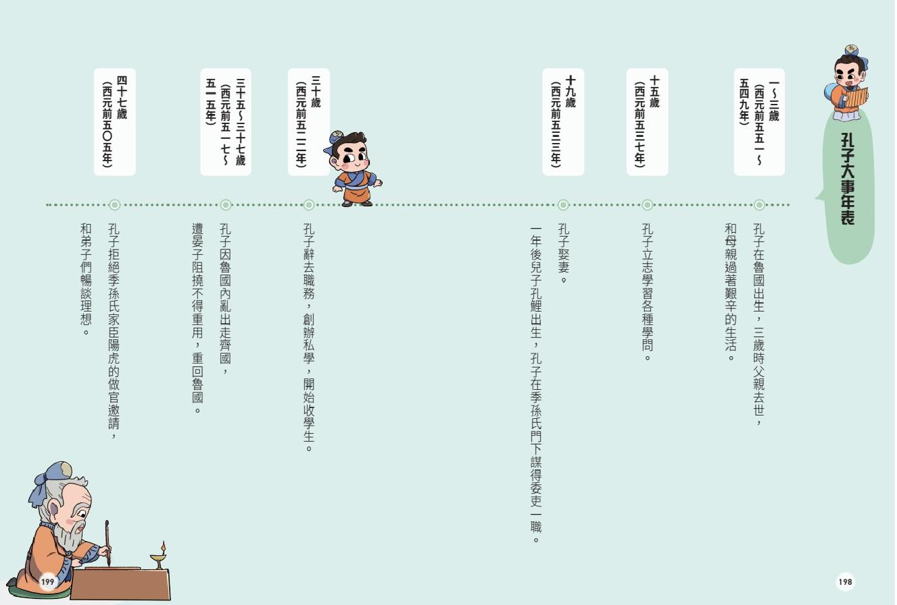

# 孔子人生時間線

> 孔子（西元前 552 年—西元前 479 年），名丘，字仲尼。其一生歷經求學、授徒、從政、周遊列國與晚年講學，對中國思想、教育與文化產生深遠影響。

## 人生歷程概覽

| 人生階段   | 聖元紀年      | 主要歷程                           |
| ---------- | ------------- | ---------------------------------- |
| 誕生與成長 | 聖元 1–20 年  | 出生、家庭變故、婚姻與早年生活     |
| 求學與授徒 | 聖元 21–37 年 | 開始授徒、訪問賢者、赴齊聞《韶》樂 |
| 從政與周遊 | 聖元 48–65 年 | 出仕魯國、參與政治、離魯周遊列國   |
| 晚年講學   | 聖元 69–72 年 | 返回魯國、整理學術、延續教育事業   |
| 逝世與傳承 | 聖元 73–74 年 | 弟子仲由去世，孔子逝世             |

## 重要事件年表

### 第一階段：誕生與成長

- **聖元 1 年｜出生**：生於魯襄公二十一年（西元前 552 年）。
- **聖元 4 年｜父親去世**：父叔梁紇卒。
- **聖元 18 年｜母親去世**：母顏徵在卒。
- **聖元 20 年｜成婚**：娶宋亓官氏。

### 第二階段：求學與授徒

- **聖元 21 年｜家庭生活**：生子孔鯉，字伯魚。
- **聖元 28 年｜向郯子問學**：郯子來朝，孔子向其學習古代官制與官名。
- **聖元 31 年｜開始授徒**：孔子年三十，開始授徒設教，弟子先後從學。
- **聖元 36 年｜赴齊聞《韶》樂**：魯國發生政治變故，孔子赴齊。
- **聖元 37 年｜返回魯國**：結束此次赴齊之行。

### 第三階段：從政與周遊

- **聖元 48 年｜陽貨之亂**：魯國陽貨執季桓子。
- **聖元 52 年｜開始出仕**：孔子任魯國中都宰。
- **聖元 53 年｜任司空、大司寇**：參與魯定公與齊侯的夾谷之會。
- **聖元 55 年｜墮三都之議**：推動拆除三都，最終未能完成。
- **聖元 56 年｜離魯適衛**：離開魯國，前往衛國。
- **聖元 58 年｜見衛靈公**：在衛國出仕，並見南子。
- **聖元 61 年｜赴陳**：經曹、宋而至陳，期間遭遇宋司馬桓魋的威脅。
- **聖元 64 年｜陳蔡絕糧**：吳國攻陳，孔子輾轉於陳、蔡、葉等地。
- **聖元 65 年｜再仕衛國**：再次在衛國出仕。

### 第四階段：晚年講學

- **聖元 69 年｜返回魯國**：應季康子之召返回魯國，繼續講學。
- **聖元 70 年｜孔鯉去世**：孔子的兒子孔鯉卒。
- **聖元 72 年｜顏回去世與《春秋》絕筆**：顏回卒；魯國西狩獲麟，孔子《春秋》絕筆。

### 第五階段：逝世與傳承

- **聖元 73 年｜仲由去世**：仲由死於衛國。
- **聖元 74 年｜孔子逝世**：卒於魯哀公十六年（西元前 479 年）。

## 配圖

